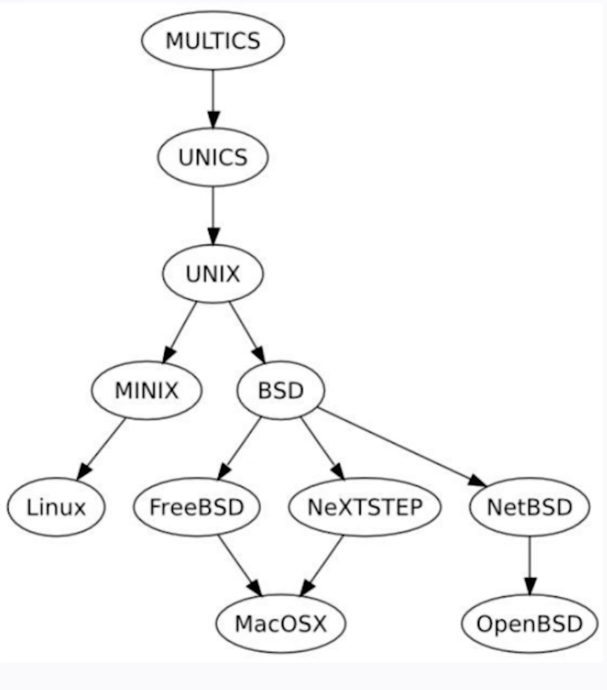
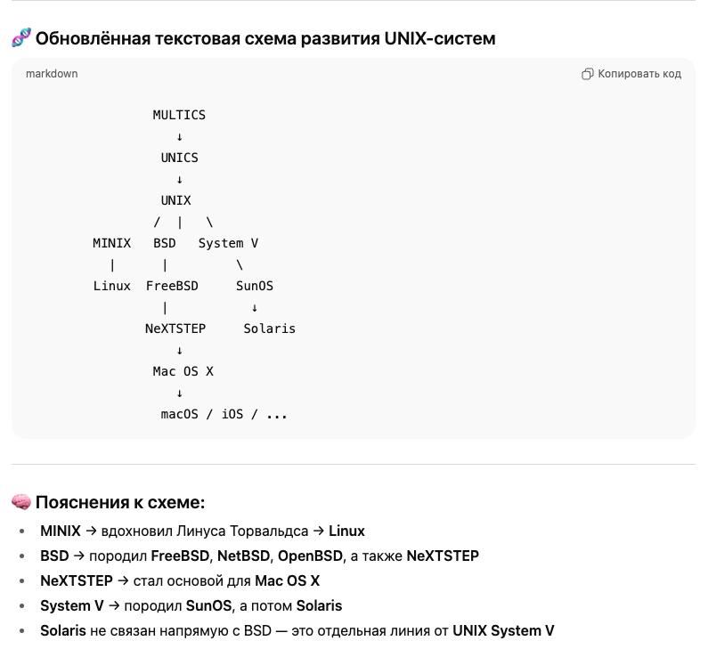

# 🌐 Что такое *nix-системы?

> **\*nix (Unix-like)** — общее название для **операционных систем, основанных на архитектуре и философии UNIX**, независимо от того, имеют ли они официальную сертификацию «UNIX®».

---

## 📚 Классификация *nix-систем

### 1. 🧓 Классические UNIX-системы  
(исторически сертифицированные или производные от оригинального UNIX System V / BSD)

- **Solaris** (Oracle Solaris, ранее Sun Solaris)
- **AIX** (IBM)
- **HP-UX** (Hewlett-Packard)
- **IRIX**, **SCO UNIX** и др.

🔹 Сейчас почти **не используются**, кроме редких энтерпрайз-наследий.

---

### 2. 🧬 BSD-семейство (свободные, современные)

- **FreeBSD**
- **OpenBSD**
- **NetBSD**

🔹 Используются на серверах, сетевых устройствах, в системах хранения (например, TrueNAS).

---

### 3. 🍏 macOS

- Построен на ядре **XNU** (гибрид Mach + BSD)
- Пользовательская ОС Apple, POSIX-совместима

🔹 По сути — коммерческий BSD-потомок, но не Linux.

---

### 4. 🐧 Linux-системы

- ОС на базе **ядра Linux**, с огромным выбором дистрибутивов
- **Не является оригинальным UNIX**, но **совместима на уровне API**
- **Доминирует** в облаках, на серверах, в контейнерах и встраиваемых системах

🔹 Debian, Ubuntu, Fedora, RHEL, Alpine и т.д.

---

## 🧠 Вывод

> Все эти системы — **Unix-подобные (\*nix)**, потому что они:
> - используют схожие командные утилиты;
> - поддерживают POSIX API (апи к запросов к ядру; набор стандартов, описывающих интерфейсы между прикладными программами и ОС);
> - развиваются в духе архитектуры UNIX:  
>   — «всё — файл»  
>   — «делай одну вещь хорошо»  
>   — «пайплайны»  
>   — «многопользовательскость»